# ULima ++
App móvil diseñada para estudiantes de la Universidad de Lima que facilita la gestión académica en un solo lugar.

---

## Tabla de Contenidos
* [Descripcion del entorno de desarrollo](#descripcion-del-entorno-de-desarrollo)
* [Casos de Uso por Paquete](#casos-de-uso-por-paquete)
* [Catálogo de Requerimientos](#catálogo-de-requerimientos)
* [Diseño de Lógica y Datos](#diseño-de-lógica-y-datos)
* [Diagrama de Despliegue](#diagrama-de-despliegue)
* [Mockups](#mockups)

---
## Descripcion del entorno de desarrollo
> Esta sección detalla las herramientas y tecnologías configuradas para el diseño y construcción del proyecto.

### Diseño y Prototipado
Para garantizar una experiencia de usuario (UX) coherente y una identidad visual sólida, se utilizaron:

* **Figma:** Utilizado para el diseño de interfaces (UI), prototipado de alta fidelidad y definición del sistema de diseño (colores, tipografía y componentes).
* **Inkscape:** Herramienta de vectores utilizada específicamente para el diseño de logotipos e iconografía personalizada del proyecto, exportando docs/images en formato `.svg`.
---

### Stack de Desarrollo Mobile
El entorno está optimizado para el desarrollo multiplataforma buscando eficiencia en el rendimiento nativo.

| Herramienta | Función | Versión Sugerida |
| :--- | :--- | :--- |
| **Flutter SDK** | Framework principal de desarrollo UI | `3.41.6` (Stable) |
| **Android Studio** | Gestión de emuladores | `Otter 2 Feature Drop` |
| **Dart** | Lenguaje de programación | `3.11.4` |
| **VSCode** | Editor de código | `1.118.1` |

### Guía Detallada de Instalación del Entorno
Para asegurar la correcta ejecución del proyecto, siga estos pasos de configuración:

#### 1. Instalación de Flutter SDK
1. Descargue la versión **3.41.6 (Stable)** desde el sitio oficial de Flutter.
2. Descomprima el archivo en una ruta segura y sin espacios (ejemplo: `C:\src\flutter` en Windows o `~/development/flutter` en macOS/Linux).
3. **Variables de entorno:** Agregue el directorio `bin` de Flutter a la variable `PATH` de su sistema operativo.
4. Abra una terminal y ejecute `flutter doctor` para verificar que el SDK esté correctamente configurado.

#### 2. Configuración de Android Studio

1. Descargue e instale **Android Studio (Otter 2 Feature Drop)**.
2. Diríjase a *SDK Manager > SDK Tools*, asegúrese de que estén seleccionados:  
   - **Android SDK Build-Tools**  
   - **Android SDK Platform-Tools**  
   - **Android Virtual Device**  
   - **Android SDK Command-line Tools (latest)**  
   - **Android Emulator**  
   - **Android Emulator hypervisor driver (installer)**

3. **Instalación de Plugins:** Abra el programa, vaya a *Settings > Plugins* y busque e instale el plugin de **Flutter** (esto instalará automáticamente el de **Dart**).

#### 3. Configuración de VSCode
1. Instale **VSCode (versión 1.118.1)**.
2. Vaya a la pestaña de extensiones (`Ctrl+Shift+X`) e instale la extensión oficial de **Flutter**.
3. Reinicie el editor para que se activen todas las herramientas de desarrollo.

#### 4. Verificación Final
Desde la carpeta raíz del repositorio en su terminal, ejecute:
* `flutter pub get`: Para descargar todas las librerías y dependencias necesarias.
* `flutter doctor`: Para confirmar que el IDE, el SDK y los emuladores estén vinculados y listos para trabajar.

## Casos de Uso por Paquete

### Paquete Autenticación y Seguridad
Este paquete contiene los casos de uso correspondientes a la Autenticación y Seguridad. Aquí se incluyen los casos de uso que permitirán validar que el usuario ingrese al sistema con sus datos personales y se valide su información.
| Item | Nombre | Caso de Uso | Req. Funcional relacionado |
| :--- | :--- | :--- | :--- |
| **CU1** | **Iniciar sesión** | El propósito de este caso de uso es permitir a los usuarios registrados acceder al sistema mediante sus credenciales y contraseña. |1 |
| **CU2** | **Cerrar sesión** | El propósito de este caso de uso es permitir al usuario finalizar su sesión activa, protegiendo su información. | 2 |

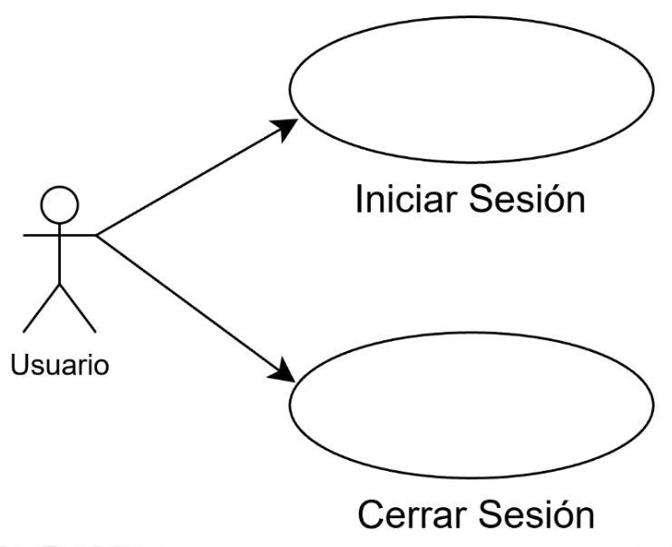

### Paquete Gestión del Perfil Académico
Este paquete contiene los casos de uso relacionados con la gestión de la información académica del estudiante dentro del sistema. En este paquete se incluyen los casos de uso que permiten al estudiante configurar y mantener actualizados sus datos académicos, tales como carrera, especialidades y preferencias curriculares. 
| Item | Nombre | Caso de Uso | Req. Funcional relacionado |
| :--- | :--- | :--- | :--- |
| **CU3** | **Seleccionar Carrera** | El propósito de este caso de uso es permitir al alumnado seleccionar su carrera universitaria dentro del sistema, lo cual habilita la carga de la malla curricular correspondiente y define el conjunto de cursos obligatorios y electivos que el estudiante deberá cursar. | 3 |
| **CU4** | **Seleccionar Especialidades** | El propósito de este caso de uso es permitir al alumnado seleccionar una o más especialidades asociadas a su carrera, con el fin de personalizar su trayectoria académica, definiendo los cursos electivos que deberá cursar. |12 |
| **CU5** | **Visualizar Cursos Electivos por Especialidad** | El propósito de este caso de uso es mostrar al usuario los cursos electivos correspondientes a la especialidad seleccionada, actualizando dinámicamente la información presentada en la malla curricular y facilitando la planificación académica del estudiante. | 13 |

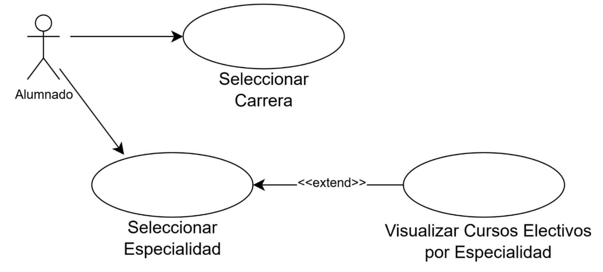

### Paquete Gestión de Malla Curricular
En este paquete los casos de uso van relacionados a la visualización y administración del avance académico del alumno dentro de su plan de estudio. En este paquete se brinda un entorno didáctico e informativo.
| Item | Nombre | Caso de Uso | Req. Funcional relacionado |
| :--- | :--- | :--- | :--- | 
| **CU6** | **Visualizar malla curricular** | El propósito de este caso de uso es permitir que el estudiante pueda ver su avance en su carrera, cursos que ha culminado o cursos que tiene disponibles para llevar en su ciclo regular. | 4 |
| **CU7** | **Actualizar estado de cursos** | El propósito de este caso de uso es permitir seleccionar el estado que se encuentran los cursos del alumnado (Disponible, En Proceso o Finalizado), con el fin de actualizar su avance. |5 |
| **CU8** | **Visualizar cursos hábiles** | El propósito de este caso de uso es mostrar al estudiante los cursos que se encuentran disponibles para ser cursados, basándose en el cumplimiento de cursos prerrequisitos establecidos en la malla curricular. | 10 |
| **CU9** | **Visualizar estado de cursos** | El propósito de este caso de uso es permitir al usuario consultar la situación actual de cada curso (Pendiente, Disponible, En Proceso, Finalizado) para un seguimiento detallado. |11 |

### Paquete Seguimiento Académico
En este paquete los casos de uso están orientados al registro, visualización y control del rendimiento académico del alumnado durante el desarrollo de sus cursos. Permite gestionar información como notas, sílabos, promedios y evaluaciones, brindando herramientas que facilitan el seguimiento continuo del progreso académico y las evaluaciones durante el ciclo.
| Item | Nombre | Caso de Uso | Req. Funcional relacionado |
| :--- | :--- | :--- | :--- |
| **CU10** | **Ingresar notas por examen** | El propósito de este caso de uso es ingresar las notas por evaluación para simular el rendimiento académico esperado en los cursos matriculados. | 6 |
| **CU11** | **Subir sílabo por Curso** | El propósito de este caso de uso es permitir seleccionar el estado que se encuentran los cursos del alumnado (Disponible, En Proceso o Finalizado), con el fin de actualizar su avance. | 7 y 8 |
| **CU12** | **Visualizar promedio por Curso** | El propósito de este caso de uso es permitir al estudiante visualizar el promedio  de los cursos que esté llevando en el ciclo. | 9 y 11 |
| **CU13** | **Visualizar horarios de asesoría** | El propósito de este caso de uso es que el alumnado pueda visualizar el horario de asesorías de clases matriculadas en el detalle del curso correspondiente, con el objetivo de que pueda organizar mejor su tiempo académico. | 20 |
| **CU14** | **Visualizar lista de exámenes** | El propósito de este caso de uso es permitir al alumnado visualizar los exámenes del ciclo en su calendario personal, ordenados según la semana y día de cada evaluación. |19|

### Paquete Análisis de Riesgo Académico
En este paquete los casos de uso están enfocados en la identificación temprana de situaciones que puedan afectar el rendimiento académico del alumnado. A través del análisis del progreso en los cursos y la carga académica, el sistema genera alertas preventivas que permiten al estudiante tomar decisiones oportunas para mejorar su desempeño o evitar sobrecarga académica.
| Item | Nombre | Caso de Uso | Req. Funcional relacionado |
| :--- | :--- | :--- | :--- |
| **CU15** | **Recibir Alertas** | El propósito de este caso de uso es notificar automáticamente al estudiante sobre situaciones de riesgo académico, ya sea por bajo rendimiento (cuando el promedio es crítico al superar el 50% del curso) o por la detección anticipada de semanas de alta carga académica (cuando se detectan tres o más evaluaciones en una semana), permitiéndole tomar medidas correctivas o preventivas a tiempo. | 15, 16, 22 y 23 |

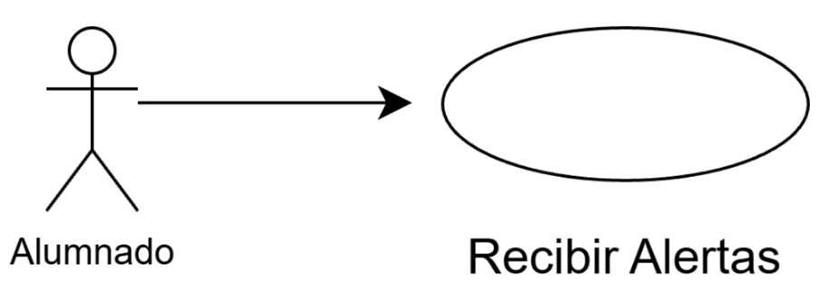

### Paquete Gestión de Sección
En este paquete los casos de uso están relacionados con la comunicación y gestión académica dentro de una sección de clase. Permite a los delegados y subdelegados coordinar información relevante, mientras que los estudiantes pueden mantenerse informados sobre actividades, anuncios y el desempeño general del grupo, promoviendo una mejor organización y colaboración académica.
| Item | Nombre | Caso de Uso | Req. Funcional relacionado |
| :--- | :--- | :--- | :--- |
| **CU16** | **Registrar Anuncios** | El propósito de este caso de uso es permitir al delegado/subdelegado registrar y enviar anuncios al alumnado.  | 17 |
| **CU17** | **Visualizar Anuncios** | El propósito de este caso de uso es permitir al alumnado ver los anuncios académicos realizados por los delegados de las secciones. | 18 |
| **CU18** | **Visualizar promedios de la sección** | El propósito de este caso de uso es que el delegado/subdelegado visualice la distribución general de las calificaciones del curso mediante un *dashboard*, con el fin de analizar el rendimiento sin mostrar datos individuales. | 14 y 21 |

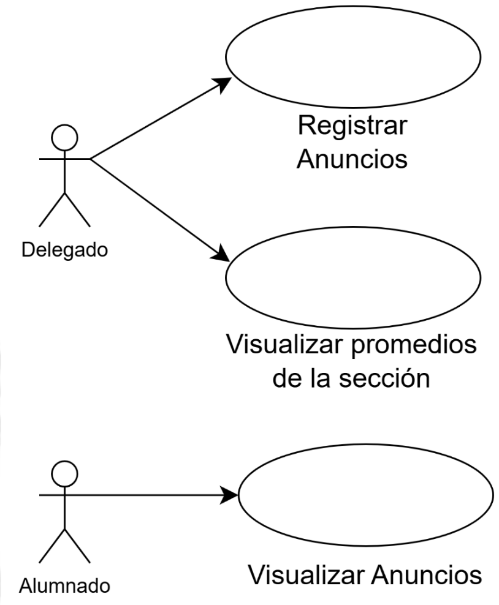

## Catálogo de Requerimientos

### Requerimientos Funcionales
| Item | Requerimiento |
| :--- | :--- |
| **R1** | El sistema deberá permitir al usuario iniciar sesión mediante su código y contraseña. |
| **R2** | El sistema deberá permitir al usuario cerrar sesión de forma segura. |
| **R3** | El sistema deberá permitir al alumnado seleccionar su carrera. |
| **R4** | El sistema deberá mostrar una malla curricular interactiva según la carrera del alumnado. |
| **R5** | El sistema deberá permitir al alumnado actualizar el estado de los cursos directamente desde la interfaz de la malla curricular, siguiendo el flujo: Disponible, En Proceso, Finalizado. |
| **R6** | El sistema deberá permitir ingresar las notas por examen en los cursos del alumnado. |
| **R7** | El sistema deberá permitir al alumnado subir los sílabos de sus cursos. |
| **R8** | El sistema deberá establecer los pesos de las evaluaciones de un curso en base a su sílabo. |
| **R9** | El sistema deberá calcular automáticamente la nota actual del curso según los pesos establecidos en el sílabo y mostrar el resultado actualizado al alumnado cada vez que se registre una nueva evaluación. |
| **R10** | El sistema deberá mostrar al alumnado los cursos hábiles en la malla curricular. |
| **R11** | El sistema deberá mostrar el estado de cada curso matriculado del alumno (Pendiente, Disponible, En Proceso, Finalizado) en la malla curricular interactiva. |
| **R12** | El sistema deberá brindar la opción al alumnado de seleccionar una o más especialidades. |
| **R13** | En caso el alumnado seleccione alguna especialidad, el sistema mostrará los cursos electivos correspondientes a cada especialidad. |
| **R14** | El sistema deberá calcular la nota promedio de cada sección, utilizando las calificaciones finales de todo el alumnado, asegurando que solo se consideren los registros válidos. |
| **R15** | El sistema deberá identificar una situación de riesgo académico cuando el avance del curso sea superior al 55% y el promedio actual del alumnado sea menor a 10.5 o inferior al promedio de la sección. |
| **R16** | El sistema deberá notificar al alumnado mediante alertas ante la detección de riesgo académico o semanas de alta carga académica. |
| **R17** | El sistema deberá permitir al delegado registrar anuncios de evaluaciones como exámenes y otras actividades académicas. |
| **R18** | El sistema deberá mostrar al alumnado los anuncios realizados por el delegado de su sección. |
| **R19** | El sistema deberá mostrar al alumnado la lista de exámenes del ciclo, organizada según la semana y el día de cada evaluación. |
| **R20** | El sistema deberá mostrar el horario de asesoría dentro del detalle de los cursos del alumnado. |
| **R21** | El sistema deberá permitir al delegado visualizar la distribución de promedios del curso, sin mostrar datos individuales. |
| **R22** | El sistema deberá calcular el total de evaluaciones programadas por semana. |
| **R23** | El sistema deberá identificar las semanas de alta carga académica, según el número de evaluaciones y cursos. |

### Requerimientos No Funcionales
| Item | Requerimiento |
| :--- | :--- |
| **1** |El sistema deberá estar disponible el 99% del tiempo, las 24 horas del día, los 7 días de la semana. |
| **2** |El sistema deberá garantizar la seguridad y confidencialidad de los datos personales del usuario. |
| **3** |El sistema deberá responder a las acciones del usuario en un tiempo menor a 2 segundos en condiciones normales de operación. |
| **4** |El sistema deberá mantener la información persistente entre sesiones. |
| **5** |El sistema deberá cumplir con las políticas institucionales de protección de datos personales y la normativa vigente de privacidad. |
| **6** |El sistema deberá asegurar que el acceso a la información académica esté restringido según el rol del usuario (estudiante, delegado, subdelegado, soporte, administrador). |
| **7** |El sistema deberá proteger las credenciales del usuario mediante mecanismos de autenticación seguros. |
| **8** |El sistema deberá garantizar la integridad de los datos académicos durante los procesos de cálculo y simulación. |
| **9** |El sistema deberá contar con un servicio de soporte técnico activo, disponible al menos en horario laboral, con un tiempo de respuesta inicial no mayor a 24 horas. |
| **10** |El sistema deberá ser accesible desde dispositivos móviles con sistema operativo Android. |
| **11** |El sistema deberá ser intuitivo y fácil de usar, permitiendo que los nuevos usuarios aprendan a utilizar sus funcionalidades principales en un tiempo menor a 20 minutos. |
| **12** |El sistema deberá soportar el acceso concurrente de múltiples usuarios sin degradar significativamente su rendimiento. |
| **13** |El sistema deberá mantener un desempeño estable durante periodos de alta demanda académica, como matrículas y semanas de evaluaciones. |
| **14** |El sistema deberá presentar una interfaz coherente y consistente con los lineamientos de diseño institucional de la universidad. |
| **15** |El sistema deberá permitir futuras extensiones a otras plataformas móviles sin requerir un rediseño significativo de su arquitectura principal. |

### Matriz de Trazabilidad

| Req \ CU | CU1 | CU2 | CU3 | CU4 | CU5 | CU6 | CU7 | CU8 | CU9 | CU10 | CU11 | CU12 | CU13 | CU14 | CU15 | CU16 | CU17 | CU18 |
| :------: | :-: | :-: | :-: | :-: | :-: | :-: | :-: | :-: | :-: | :--: | :--: | :--: | :--: | :--: | :--: | :--: | :--: | :--: |
| R1  | X |   |   |   |   |   |   |   |   |   |   |   |   |   |   |   |   |   |
| R2  |   | X |   |   |   |   |   |   |   |   |   |   |   |   |   |   |   |   |
| R3  |   |   | X |   |   |   |   |   |   |   |   |   |   |   |   |   |   |   |
| R4  |   |   |   |   |   | X |   |   |   |   |   |   |   |   |   |   |   |   |
| R5  |   |   |   |   |   |   | X |   |   |   |   |   |   |   |   |   |   |   |
| R6  |   |   |   |   |   |   |   |   |   | X |   |   |   |   |   |   |   |   |
| R7  |   |   |   |   |   |   |   |   |   |   | X |   |   |   |   |   |   |   |
| R8  |   |   |   |   |   |   |   |   |   |   | X |   |   |   |   |   |   |   |
| R9  |   |   |   |   |   |   |   |   |   |   |   | X |   |   |   |   |   |   |
| R10 |   |   |   |   |   |   |   | X |   |   |   |   |   |   |   |   |   |   |
| R11 |   |   |   |   |   |   |   |   | X |   |   | X |   |   |   |   |   |   |
| R12 |   |   |   | X |   |   |   |   |   |   |   |   |   |   |   |   |   |   |
| R13 |   |   |   |   | X |   |   |   |   |   |   |   |   |   |   |   |   |   |
| R14 |   |   |   |   |   |   |   |   |   |   |   |   |   |   |   |   |   | X |
| R15 |   |   |   |   |   |   |   |   |   |   |   |   |   |   | X |   |   |   |
| R16 |   |   |   |   |   |   |   |   |   |   |   |   |   |   | X |   |   |   |
| R17 |   |   |   |   |   |   |   |   |   |   |   |   |   |   |   | X |   |   |
| R18 |   |   |   |   |   |   |   |   |   |   |   |   |   |   |   |   | X |   |
| R19 |   |   |   |   |   |   |   |   |   |   |   |   |   | X |   |   |   |   |
| R20 |   |   |   |   |   |   |   |   |   |   |   |   | X |   |   |   |   |   |
| R21 |   |   |   |   |   |   |   |   |   |   |   |   |   |   |   |   |   | X |
| R22 |   |   |   |   |   |   |   |   |   |   |   |   |   |   | X |   |   |   |
| R23 |   |   |   |   |   |   |   |   |   |   |   |   |   |   | X |   |   |   |

## Diseño de Lógica y Datos

Para asegurar que los requisitos funcionales tengan un soporte técnico sólido, se han definido los siguientes modelos que rigen la estructura del sistema:

### Diagrama de Clases
Este diagrama define la estructura de objetos en Dart/Flutter. Representa cómo entidades como `Alumno`, `Curso`, `Nota` y `Sección` interactúan lógicamente para procesar la información académica.

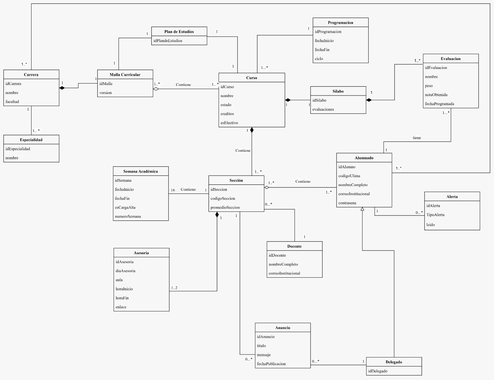

<!-- 

### Diagrama Entidad-Relación (Base de Datos)
Este modelo asegura la integridad de los datos de las evaluaciones, sílabos y registros de usuarios.

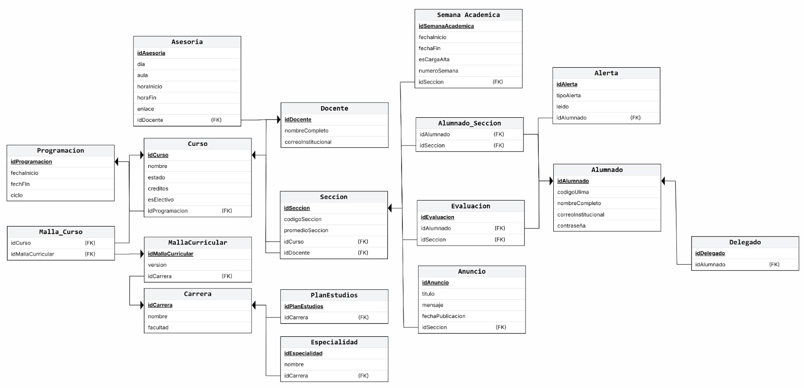

---

## Diagrama de Despliegue

### Descripción General

El diagrama de despliegue de **ULima++** representa la arquitectura del sistema en producción, mostrando cómo interactúan los diferentes componentes desde el dispositivo móvil del usuario hasta los servidores backend.

### Arquitectura del Sistema

La arquitectura implementa un modelo de **cliente-servidor distribuido** con separación clara de responsabilidades:

**Capa de Presentación (Cliente):**
- Aplicación móvil nativa desarrollada en **Flutter** para dispositivos Android
- Comunicación segura con el backend mediante protocolo **HTTPS/JSON**

**Servicio de Autenticación (Externo e Independiente):**
- **Autenticación centralizada** (OAuth 2.0 / JWT) separada del backend principal
- Gestiona credenciales institucionales y genera tokens de sesión
- Control de roles: estudiante, delegado, subdelegado, soporte, administrador
- Garantiza **disponibilidad independiente** del API principal (Req #1: 99%)
- Puede integrarse con sistemas institucionales (LDAP, Shibboleth)

**Capa de Aplicación (Servidor Backend):**
- **Load Balancer/Reverse Proxy**: Distribuye las solicitudes entre múltiples instancias del API para garantizar disponibilidad 99% y manejar acceso concurrente
- **API REST (Ruby Sinatra)**: Punto central de acceso a datos. Es el único componente que accede a la base de datos, implementando el patrón *single source of truth*
- **Servicio de Notificaciones**: Genera y envía alertas académicas a los usuarios

**Capa de Datos y Almacenamiento:**
- **Cache (Redis)**: Almacenamiento en memoria para datos frecuentemente consultados, optimizando respuestas a menos de 2 segundos
- **MySQL**: Base de datos relacional principal para persistencia de datos académicos
- **Almacenamiento de Archivos**: Sistema para gestión de sílabos y documentos académicos

### Flujo de Comunicación

1. La app móvil envía credenciales al Servicio de Autenticación externo
2. El servicio de autenticación valida y genera un token JWT
3. La app móvil envía solicitudes autenticadas al Load Balancer (con el token)
4. El Load Balancer distribuye las peticiones al API REST
5. El API valida el token y consulta el caché si es necesario
6. Para datos no en caché, el API accede a MySQL
7. El API emite alertas a través del Servicio de Notificaciones
8. Las respuestas retornan al cliente en formato JSON

### Principios de Diseño

- **Desacoplamiento**: Los servicios se comunican a través del API, no directamente a la BD
- **Escalabilidad**: Fácil agregar nuevas instancias del API o servicios sin modificar la estructura existente
- **Seguridad**: Punto único de control de acceso a datos sensibles + Autenticación independiente
- **Rendimiento**: Caché distribuido reduce latencia y carga en la BD
- **Disponibilidad**: Load Balancer garantiza redundancia y tolerancia a fallos; Servicio de Autenticación independiente asegura continuidad
- **Tolerancia a fallos**: Servicio de autenticación externo no depende del API principal

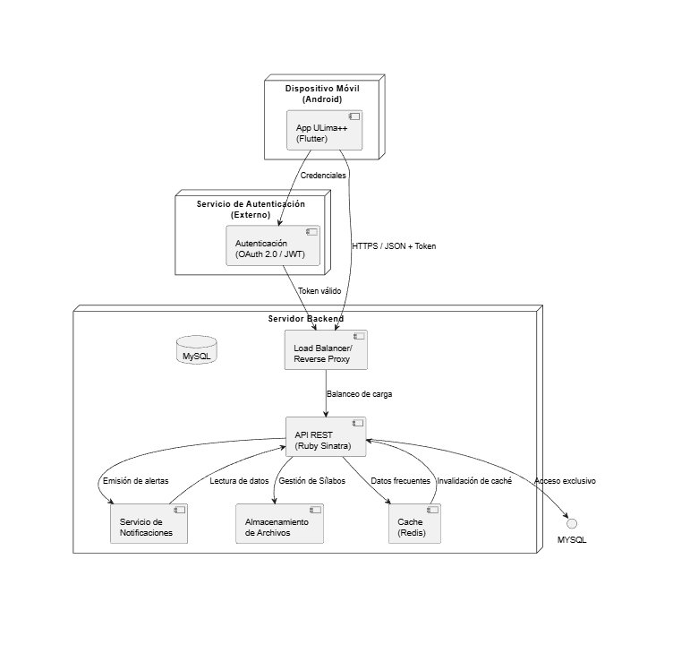

> **Especificación técnica:** [`diagrama_despliegue.puml`](docs/images/arquitectura/diagrama_despliegue.puml)

### Componentes

- **Servicio de Autenticación (Externo)**: Gestión centralizada de identidad y tokens (OAuth 2.0 / JWT)
- **Load Balancer**: Balanceo de carga y disponibilidad
- **Servicio de Notificaciones**: Alertas y comunicación
- **Cache (Redis)**: Optimización de rendimiento
- **MySQL**: Persistencia de datos (acceso exclusivo a través del API)
- **Almacenamiento de Archivos**: Gestión de sílabos

### Decisiones Arquitectónicas

- **Patrón Single Source of Truth**: Solo el API accede a MySQL, garantizando consistencia de datos
- **Servicio de Autenticación Externo**: Separado del backend para garantizar disponibilidad 99%, independencia de fallos y escalabilidad (Req #1, #6, #7)
- **Separación de responsabilidades**: Cada servicio tiene una función específica y bien definida
- **Tecnologías seleccionadas**: Ruby Sinatra por su simpleza y eficiencia, MySQL por confiabilidad, Redis para caché distribuido, OAuth 2.0/JWT para autenticación segura
-->

## Mockups

> Esta sección presenta la propuesta de diseño de la interfaz de usuario (IU) para **ULima++**, basada en el prototipo desarrollado en Figma.
>
> Video demostratrivo: https://drive.google.com/file/d/1bGTRMExhHZ1AsrDhI6LxNjelqr9DeJNx/view?usp=sharing

## Registro e Inicio de Sesión

| Inicio de Sesión | Configuración de carrera |
| :---: | :---: |
|  | 

---

## Control Académico e Interacción

| Malla Curricular | Calculadora de Notas | Horario Académico |
| :---: | :---: | :---: |
|  |  |  |

---

## Calculadora de Notas

| Gestión de Sílabo | Agregar Nota | Visualización de Notas |
| :---: | :---: | :---: |
|  |  | 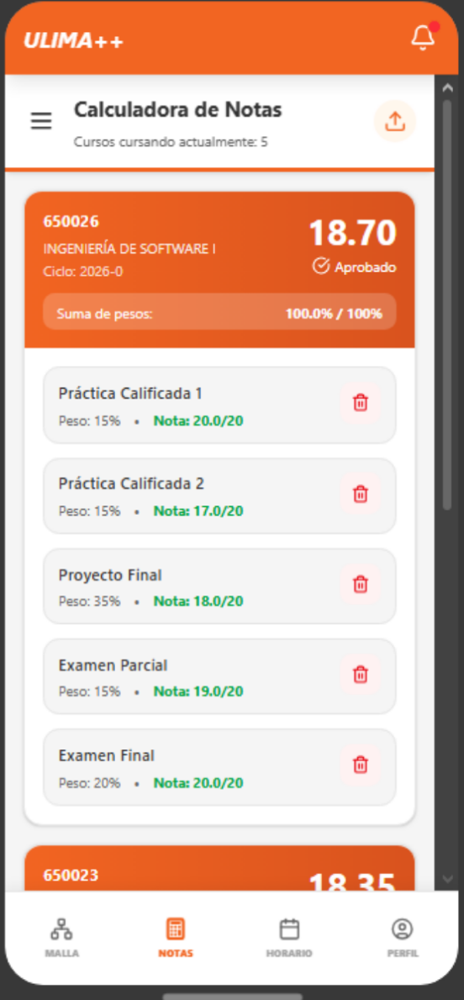 |

## Detalles de Curso

| Anuncios | Asesorias | Contactos |
| :---: | :---: | :---: |
| 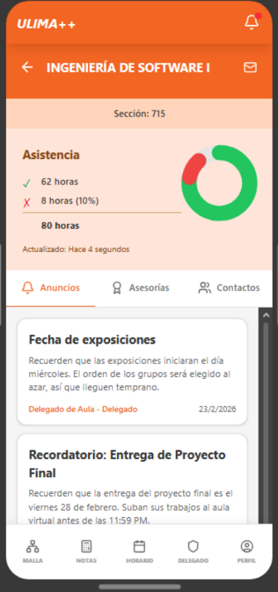 |  |  | 

## Perfil y Notificaciones

| Perfil | Buzón de Alertas |
| :---: | :---: |
|  | 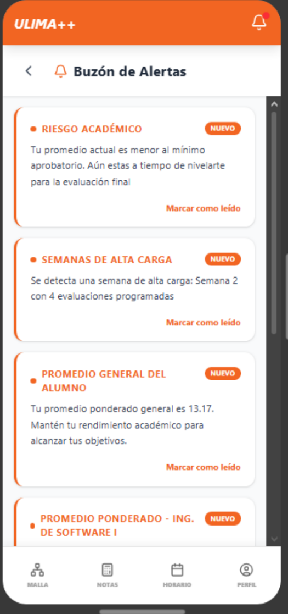 |

### Módulo Delegado
El actor 'Delegado' contará con un módulo exclusivo que integra las siguientes interfaces:

| Gestión de Cursos | Gestion de Anuncios | Seguimiento de Progreso de Sección |
| :---: | :---: | :---: |
| 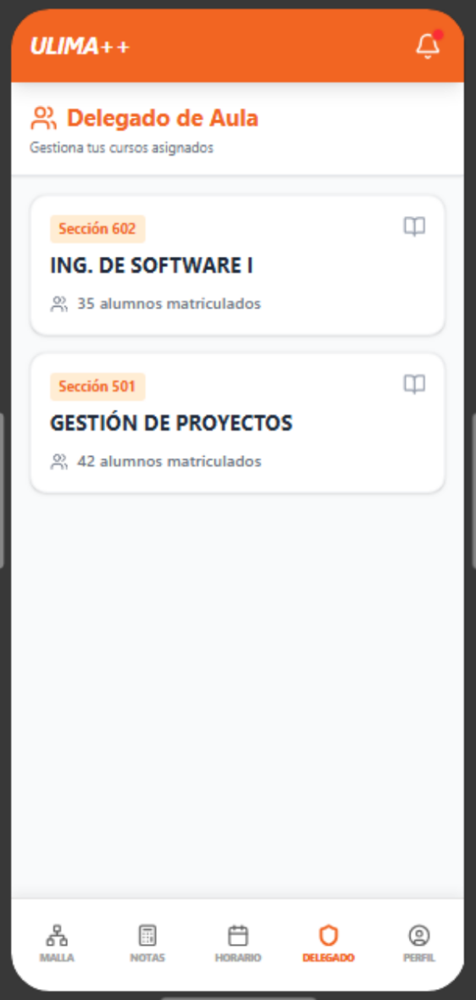 | 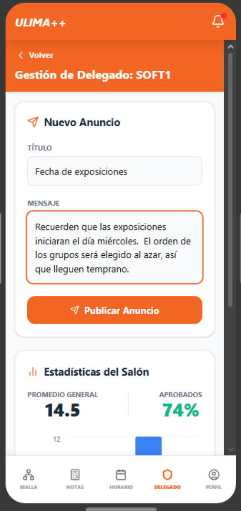 | 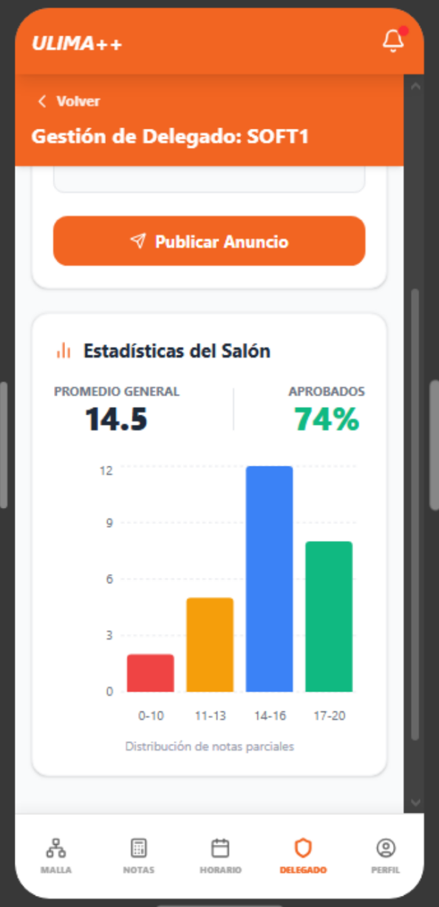 |

